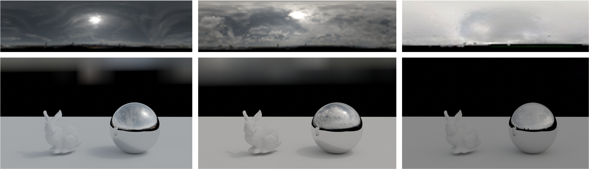

# HDR Map Reconstruction From a Single LDR Sky Panoramic Image For Outdoor Illumination Estimation


A multi-faceted approach to reconstructing HDR maps from a single LDR sky panoramic image that considers the sun and sky regions separately and accounts for various weather conditions.렌더링한다... 뭐에 사용된다.... 목적 분명하게 말하기, skydome 이미지 사용등
(This paper is under review)
</br></br>

# Requirements

- tensorflow >= 2.4
- tensorflow_adds_on
- opencv >= 4 (conda install -c conda-forge opencv)
- pandas
- tqdm
- matplotlib
</br></br>

# DataGeneration

- fisheye lens 기반 영상의 sky dome image를 input으로 사용 (elevation 0~90, azimuth 0~360)
- Generate input traing & test data from the Laval HDR dataset. \
(Redistribution of the Laval-HDR-dataset is not permitted. Please contact Jean-Francois Lalonde at jflalonde at gel dot ulaval dot ca to obtain the dataset.)

    ```
    python datasetGenerator.py

    (Optional)
    --dir :
        Absolute path of your dataset directory to save. (default : current working directory)
     
    --imheight :
        Vertical size of the output panoramic image (default : 32)

    --imwidth :
        Horizontal size of the output panoramic image (default : 128)
    ```

- The input data is encoded as TFRecord to improve training latency due to loading overhead.

- To use your own input data, your dataset must conform to the TFRecord format described below.

    ```
    feature_description = {
        'image': _bytes_feature(image),
        'azimuth': _float_feature(azimuth),
        'elevation': _float_feature(elevation),
    }
    ```

# Train

1. Download the pre-trained weights of [vgg16](https://github.com/alex04072000/SingleHDR/tree/master/training_code#:~:text=trained%20weights%20of-,vgg16,-and%20vgg16_places365_weights).
    (This is a property of [SingleHDR](https://github.com/alex04072000/SingleHDR/tree/master/training_code))

2. Pretrain a sun luminance estimator.

    ```
    python pretrain_sun.py --dir="your/dir/path" --train=True --inference_img_dir="your/dir/path"
    

    --dir :
        Absolute path of your dataset directory to train.
    
    --train :
        If "False", you can evaluate the sun luminance estimator that you trained.
    
    --inference_img_dir :
        Absolute path of your input LDR directory to evaluate your sun luminance estimator. (Enable only if --train=False) 
    
    (Optional)
        --dorf :
            Absolute path of DoRF file. (provided in git repository)
        
        --lr : 
            learning rate of training model (default : 1e-4)

        --batchsize :
            batch size of training model (default : 32)

        --epochs :
            epochs number of training model (default : 1000)
        
        --imheight :
            Vertical size of the input panoramic image (default : 32)

        --imwidth :
            Horizontal size of the input panoramic image (default : 128)
    ```

    If the previous step (DataGeneration) is skipped, your dataset must conform to our TFRecord format \
    (See item 3 in DataGenration).

3. Train a main model

    ```
    python train.py --dir="your/dir/path" --sky="sky/preweight/path" --sun="sun/preweight/path" --dorf="/txt/path" --vgg="/npy/path"

        --dir :
            Absolute path of your dataset directory to train.

        --sun :
            Absolute path of your sun luminance estimator weights file that pretrained on previous step (step 2).

        --vgg :
            Absolute path of pretrained weights file of vgg16. (see step 1)

    (Optional)
        --sky :
            Absolute path of your sky luminance estimator weights file that you pretrained.

        --dorf :
            Absolute path of DoRF file. (provided in git repository)
        
        --lr : 
           learning rate of training model (default : 1e-4)

        --batchsize :
            batch size of training model (default : 32)

        --epochs :
            epochs number of training model (default : 1000)
        
        --imheight :
            Vertical size of the input panoramic image (default : 32)

        --imwidth :
            Horizontal size of the input panoramic image (default : 128)
    ```

~~The pre-trained weight file can be downloaded from here.~~
</br></br>

# Inference

We have evaluated our model using two dataset (Laval-dataset, CAU dataset) respectively.

```
python inference.py --indir="abs/path/" --outdir="name"

    --indir :
        Absolute path of your dataset directory to inference.

    --outdir :
        Specifies the directory name of the output inference image.

    (Optional)
        --sky :
            Absolute path of your sky luminance estimator weights file that you pretrained.
            (default : os.path.join(CURRENT_WORKINGDIR, "checkpoints/SKY")))

        --sun :
            Absolute path of your sun luminance estimator weights file that you pretrained.
            (default : os.path.join(CURRENT_WORKINGDIR, "checkpoints/SKY")))
```

The CAU dataset can be downloaded from [here](https://drive.google.com/drive/folders/1-EujEiQdLnBVUENRKUOU56_g0PgdWYVI?usp=sharing).
